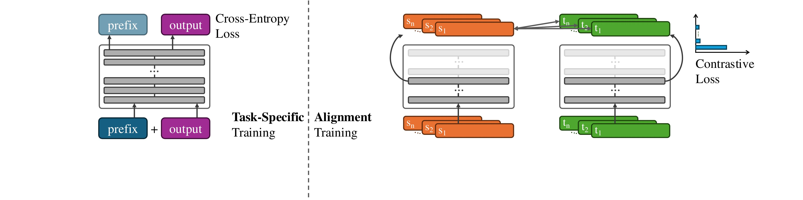

# Middle-Layer Representation Alignment for Cross-Lingual Transfer in Fine-Tuned LLMs

[](https://arxiv.org/pdf/2502.14830)
[](https://www.python.org/downloads/release/python-390/)
[](https://huggingface.co/docs/transformers/index)
 
## 📋 Overview
This repository contains the implementation of [our paper](https://arxiv.org/pdf/2502.14830), 
which aims to improve cross-lingual transfer in fine-tuned Large Language Models. 
By aligning representations between languages, 
our method improves knowledge transfer 
while maintaining performance in the supervised conditions.



## 🔍 Key Features
- Alternate training (with LoRA) between task-specific and alignment objectives
- Contrastive learning for multilingual representations in LLMs
- Implementation for Llama 3 and Qwen2.5


## 🛠️ Installation

Our implementation builds upon Huggingface Transformer version `v4.43.4`.

```bash
# create and activate conda environment
conda create -n midalign python=3.9
conda activate midalign
# install package and dependencies
pip install -e .
# pytorch
pip install torch torchvision torchaudio
# deepspeed
pip install deepspeed
# flash attention
pip install flash-attn --no-build-isolation
# other huggingface packags
pip install datasets evalute peft
# helper packages
pip install skikit-learn hf_mtask_trainer 
# for evaluation
pip install seqeval levenshtein
```
Note: If flash attention can't be installed, feel free to skip it and train wihtout it by removing [this line](https://github.com/dannigt/mid-align/blob/master/scripts/run_clm_lora.py#L643).

For a complete list of packages in our environment, please see `environment.yml`.

## 🔧 Implementation Details

We've made the following modifications to Hugging Face Transformers (`v4.43.4`):
1. **Model Architectures**: `src/transformers/models/llama/modeling_llama.py` and `src/transformers/models/qwen2/modeling_qwen2.py` to enable contrastive learning at a selected layer
2. **Training Loop**: `src/transformers/trainer.py` to support alternate training between two losses\
3. **Configuration**: `src/transformers/configuration_utils.py` to support reading in additional configuration parameters
4. **Tokenization**: `src/transformers/tokenization_utils_base.py` to support taking a pair of parallel sentences at once
5. **Loss Tracking**: `src/transformers/modeling_utils.py` to track two different losses 

## 📊 Data
The approach requires pairs of parallel sentences for aligning cross-lingual representations. 
Example data files:
- `./data_example/train_baseline.json`: For standard task-specific training
- `./data_example/train_baseline_with_alignment.json`: For training with alignment

The main experiment datasets (in `.jsonl` format) can be downloaded from [this link](https://bwsyncandshare.kit.edu/s/EDo3k3mibyejq6H).

## 🚀 Training

We have two training setups:

### 1. Task-specific Baseline Training

```bash
bash ./scripts/train_baseline.sh
```

This trains the model with standard task-specific objectives.

### 2. Training with Alignment

```bash
bash ./scripts/train_with_alignment.sh
```

Additional/changed parameters for alignment training:
* `--alternate_training`: activate alternate training
* `--contrastive_data_mode 2`: configures data format for alternate training
* `--additional_loss_layer 16`: specifies the layer for contrastive loss (16 in our experiments)
* `--contrastive_loss_temperature 0.1`: controls the peakiness of contrastive loss
* `--distance_function cosine`: defines the distance metric for representation comparison 
* `--num_train_epochs 10`: doubled from baseline due to alternate training

<details>
<summary>Expand for more details</summary>

```bash
#!/bin/bash
export NCCL_DEBUG=INFO
#export NCCL_SOCKET_IFNAME=#eno2np1 #eth1
export NCCL_IB_GID_INDEX=3
export NCCL_IB_SL=3
export NCCL_NET_GDR_READ=1

export MASTER_ADDR="${CHIEF_IP:=localhost}"
export MASTER_PORT="${MASTER_PORT:=29501}"

module load compiler/gnu/12
module load devel/cuda/12.0

HOST_NUM=1
INDEX=0

model_path="meta-llama/Meta-Llama-3-8B-Instruct"
train_files="./data_example/train_baseline.json" # replace by actual training data
valid_files="./data_example/train_baseline.json" # replace by actual validation data
train_bsz=32
eval_bsz=32
gradient_accumulation_steps=4
lora_config="./config/lora_config.json"
LR="5e-4"
OUTDIR="./test_run_outputs"
nproc_per_node=1 # number of GPUs used in training
loss_layer=16
loss_temperature=0.1
loss_distance_type="cosine"


torchrun --nnodes $HOST_NUM --node_rank $INDEX --nproc_per_node $nproc_per_node \
    --master_addr $MASTER_ADDR --master_port $MASTER_PORT  \
    ${train_path} \
    --deepspeed ./config/deepspeed_config.json \
    --bf16 True \
    --bf16_full_eval True \
    --model_name_or_path ${model_path} \
    --train_file $train_files \
    --validation_file $valid_files \
    --use_lora True \
    --lora_config ./config/lora_config.json \
    --torch_dtype bfloat16 \
    --preprocessing_num_workers 16 \
    --dataloader_num_workers 1 \
    --dataloader_pin_memory True \
    --per_device_train_batch_size $train_bsz \
    --per_device_eval_batch_size $eval_bsz \
    --gradient_accumulation_steps $gradient_accumulation_steps \
    --num_train_epochs 10 \
    --save_strategy "steps" \
    --save_steps 200 \
    --save_total_limit 2 \
    --learning_rate $LR \
    --weight_decay 0. \
    --warmup_ratio 0.03 \
    --lr_scheduler_type "inverse_sqrt" \
    --logging_steps 10 \
    --block_size 2048 \
    --do_train \
    --eval_strategy "steps" \
    --eval_steps 200 \
    --streaming \
    --ddp_timeout 3600 \
    --seed 1 \
    --gradient_checkpointing True \
    --load_best_model_at_end True \
    --metric_for_best_model "eval_loss" \
    --patience 5 \
    --output_dir $OUTDIR \
    --contrastive_data_mode 2 \
    --additional_loss_layer $loss_layer \
    --contrastive_loss_temperature $loss_temperature \
    --distance_function $loss_distance_type \
    --alternate_training \
    --disable_tqdm True --overwrite_output_dir 2>&1  | tee -a $OUTDIR/train.log
```

</details>

Our training scripts adapted from [ParroT](https://github.com/wxjiao/ParroT).

The configuration files for DeepSpeed and LoRA are included in `./config`.

## 📈 Inference and Evaluation

```bash
basemodel="meta-llama/Meta-Llama-3-8B-Instruct"
path2peftmodel="" # replace by path to finetuned model
lang="en" # replace by other langauge codes (see massive_lang_map in scripts/utils.py)

# Run inference
python -m scripts.run_inference_massive --model-name $basemodel \
                                        --peft-model-id $path2peftmodel \
                                        --lang $lang \ 
                                        --partition "test"
                                        
# Evaluate performance
python -m scripts.eval_massive --pred-slots-file $path2output \
                               --lang $lang \
                               --partition "test"
```

(inference scripts for more datasets coming soon)


